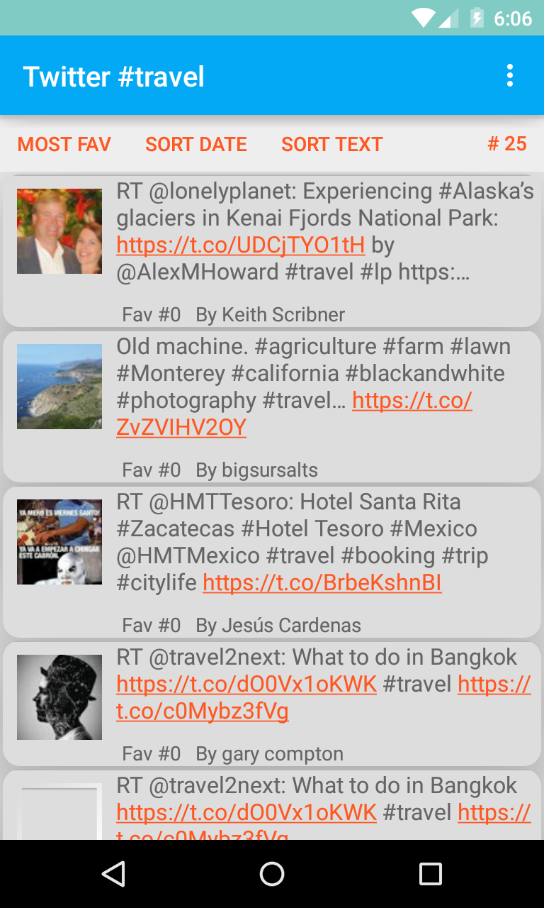

# About
This is a sample app to fetch data from twitter and display it.
Code searches for tweets with hash-tag #travel

If you want to play with this app yourself  you will need to edit the
app/src/main/res/values/strings.xml and provide various tokens & secrets for Twitter Oauth2.

* Changes
  * Dec 31, 2015
     1. Changed layout to use recyclerviewer.
     2. Added support for swipe to delete
     3. Implemented infinite scroll
  * Jan 10, 2016
     1. Remove the swipe to delete feature, code is still there but not hookedup. 
     2. Added support for pull-down to refresh and infite scroll.
     3. Improved the layout, using Cardview to display individual tweet.
     4. Discovered one can add "divider" by inserting a view and setting its style.

* Todo
   * Show geolocation on where tweet was generated.
   * Sort tweets by geolocation, show nearest to you on top.
